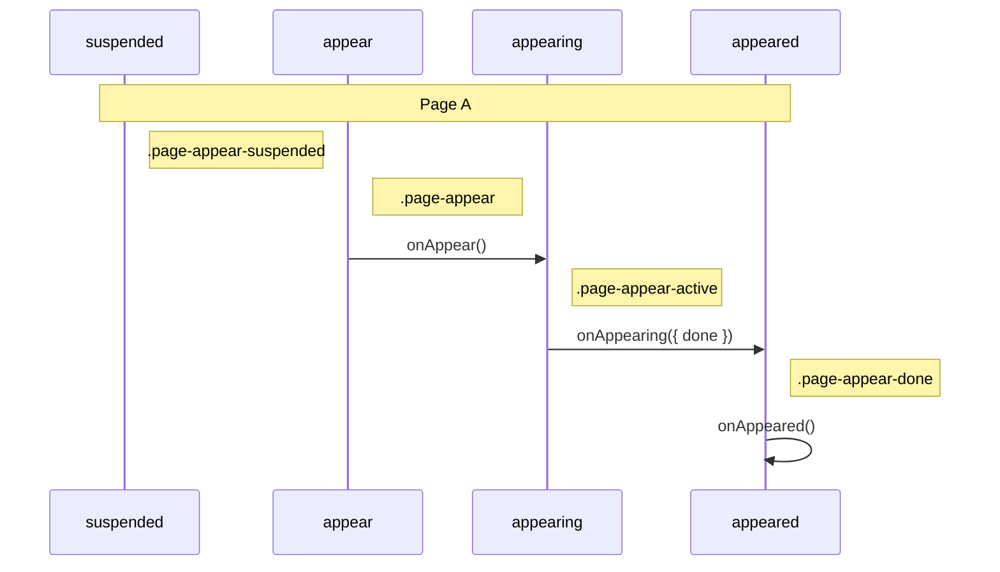
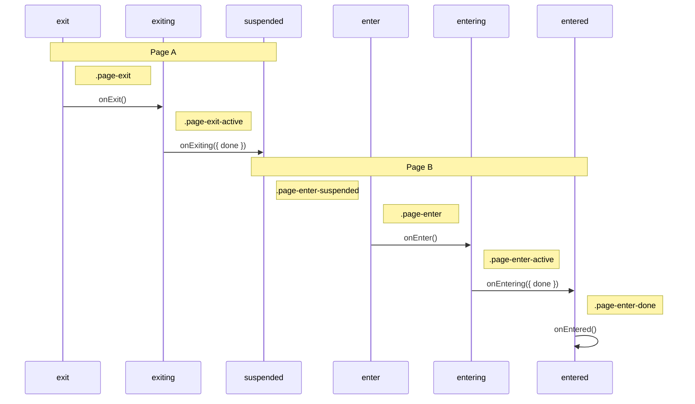

# @14islands/react-page-transitions

<br/>

A framework-agnostic page transition lib for react. Tested with CRA, Next.js, Gatsby.js

As a creative studio we often have to adapt to our clients. It would be great if we could keep the same mental model and lifecycle for page transitions, no matter the react framework we end up using.

> :bulb: This library doesn’t apply any styles to the page container, you need to manage it by yourself with an animation library or CSS transitions/animations.

Depends on `react-transition-group` for mounting/unmounting logic.

<br/>
<br/>

<p align="center">
 <a href="https://fjf81s.csb.app/"></a>

</p>
<p align="middle">
  <i>Check out <a href="https://fjf81s.csb.app/">the demo</a> and see the code.</i>
</p>

<br/>

## Design goals & features

- Should work with most common React frameworks
- Doesn't lock you in to any specific animation library
- Adds CSS classnames with transition status to the page containers. CSS animations are more performant than JS, especially while the browser is loading assets.
- Provides a hook `usePageTransition()` with transition status that can be accessed by any component in the tree
- Relies on React.Suspense for delaying transitions if a page takes time to load
- Supports default page transitions on history nav
- Supports contextual transitions triggered by links - able to pass data to current and next page
- Support barba.js sync mode - i.e. having 2 pages mounted at the same time (overlapping)
- Doesn't touch scroll position - you need to manage it yourself depending on your framework and transition timings.

<br/>
<br/>

# Getting Started

<br/>

## Install npm package

```bash
yarn add @14islands/react-page-transitions zustand react-transition-group
```

## Wrap your router pages

```jsx
// App.js
return (
  <PageTransitions pageName={location.pathname}>
    <Routes location={location}>
      <Route path="/" element={<PageHome />} />
      <Route path="/a" element={<PageA />} />
      <Route path="/b" element={<PageB />} />
    </Routes>
  </PageTransitions>
```

## Add default transitions using CSS classes

```css
.page-appear,
.page-enter {
  opacity: 0;
}
.page-enter-active,
.page-appear-active {
  opacity: 1;
  transition: opacity 1s;
}
.page-exit {
  opacity: 1;
}
.page-exit-active {
  opacity: 0;
  transition: opacity 1s;
}
```

## Get transition state using hook

```jsx
function MyComponent() {
  const { transitionState, from, to } = usePageTransition();

  const styles = useSpring({
    from: {
      x: transitionState === "entering" ? "-100%" : "0%",
    },
  });

  return <animated.div style={styles} />;
}
```

<br/>
<br/>

# Lifecycle

<br/>

## Page Load timeline

The following sequence describes a page loading for the first time.



The `suspended` state only happens if the page suspended while mounting. It continues to the `appear` state automatically when suspense has resolved. To prevent this you can define your own `<Suspense>` further down the tree, which will cause the page to animate in and show your fallback instead.

## Page Transtion timeline (mode: out-in)

The following sequence describes a page transition from "Page A" to "PageB" using the default mode "out-in". The current page exits before the new page enters.



The `suspended` state only happens if the entering page (Page B) suspended while mounting. It continues to the `appear` state automatically when suspense has resolved. To prevent this you can define your own `<Suspense>` further down the tree, which will cause the page to animate in and show your fallback instead.

<br/>
<br/>

# API

<br/>

## `<PageTransitions>`

Wrap your routes with this component so it can manage the lifecycle of mounting and unmounting pages.

By default it uses the "out-in" strategy, which means the current page animates out and is removed from the DOM before the new page is mounted and animates in.

It listens to CSS `transitionend` and CSS `animationend` events on the page container by default to trigger the lifecycle. This can be turned off either globally using the properties, or overridden per page via the `onExiting` and `onEntering` callbacks on the `usePageTransitions` hook.

> :warning: `transitionend` and `animationend` will bubble up from the page children. Whichever animation or transition finish first, will mark the page transition as done.

If you want to take manual control of the transition duration, you can use the callbacks `onEntering` and `onExiting` on the `usePageTransition` hook.

| Property            | type                     |  default   |
| ------------------- | ------------------------ | ---------- |
| mode                | out-in \| in-out \| sync | "out-in"   |
| className           | string                   | "page"     |
| timeout             | number                   | undefined |
| detectAnimationEnd  | boolean                  | true       |
| detectTransitionEnd | boolean                  | true      |

<details>
  <summary>Show React Router v6 CRA example</summary>
  
```jsx
// App.js
return (
  <PageTransitions pageName={location.pathname}>
    // Note: need to pass location to Routes
    <Routes location={location}>
      <Route path="/" element={<PageHome />} />
      <Route path="/a" element={<PageA />} />
      <Route path="/b" element={<PageB />} />
    </Routes>
  </PageTransitions>
```
</details>

<details>
  <summary>Show Next.js example</summary>

```jsx
// _app.js
function MyApp({ Component, pageProps, router }) {
  console.log("router.pathname", router.pathname);
  return (
    <PageTransitions pageName={router.pathname}>
      <Component {...pageProps} />
    </PageTransitions>
  );
}
```

</details>

<details>
  <summary>Show Gatsby.js example</summary>

```jsx
// gatsby-browser.js
export const wrapPageElement = ({ element, props: { location } }) => {
  return (
    <PageTransitions pageName={location.pathname}>{element}</PageTransitions>
  );
};
```

</details>

<br/>

## `usePageTransition()`

This hook allows any component nested within `<PageTransitions>` to listen and react to the transition state. It can also accept callbacks that will fire during the transition lifecycle.

```jsx
function MyPage() {
  const { transitionState, from, to, data } = usePageTransition({
      onEnter: ({ from, to }) => void,
      onEntering: ({ from, to, done, data }) => void
      onEntered: ({ from, to }) => void,
      onExit: ({ from, to }) => void,
      onExiting: ({ from, to, done, data }) => void
  })
}
```

### Return values

| transitionState | description                                 |
| --------------- | ------------------------------------------- |
| suspended       | Page is waiting to mount                    |
| appear          | Page is about to animate in on page load    |
| appearing       | Page is currently animating in on page load |
| appeared        | Page has finished animating in on page load |
| exit            | When page is about to animate out           |
| exiting         | Page is currently animating out             |
| exited          | Page has finished animating out             |
| enter           | Page was mounted and is about to enter      |
| entering        | Page is currently animating in              |
| entered         | Page has finished animating in              |

### Callbacks

| callbacks   | callback params    |  description                                                                                              |
| ----------- | ------------------ | --------------------------------------------------------------------------------------------------------- |
| onAppear    | { from, to }       | Page was mounted and is about to enter on page load                                                       |
| onAppearing | { from, to, done } | Page is currently animating in - the `done` function has to be called to indicated animation is complete  |
| onAppeared  | { from, to }       | Page finished animating in after page load                                                                |
| onExit      | { from, to }       | Page is about to exit due to page navigation                                                              |
| onExiting   | { from, to, done } | Page is currently animating out - the `done` function has to be called to indicated animation is complete |
| onEnter     | { from, to }       | Page was mounted and is about to enter                                                                    |
| onEntering  | { from, to, done } | Page is currently animating in - the `done` function has to be called to indicated animation is complete  |
| onEntered   | { from, to }       | Page finished animating in after page navigation                                                          |

<br/>

# setPageTransitionData

This function can be used to pass state to the pages exiting and entering. This enables contextual transitions for when clicking on specific links.

```ts
setPageTransitionData(data: any): void
```

The user is in control of figuring out what to do with that data.

```jsx
function HomePage() {
    const { transitionState, from, to } = usePageTransition({
        onExiting: async ({ from, to, done, data }) => {
            // `data` is what was passed to setPageTransitionData()
            if (data === "home-list-item") {
                await animationOutContextual()
            } else {
                await animationOutDefault()
            }
            done()
        }
    })
    return (
        <div>
        { items.map( item =>
            <Link to={item.url} onClick={() => setPageTransitionData("home-list-item")}>
                {item.label}
            </Link>
        )}
        </div>
    )
}

function ItemPage() {
    const { transitionState, from, to } = usePageTransition({
        onEntering: async ({ from, to, done, data }) => {
            // `data` is what was passed to setPageTransitionData()
            if (data === "home-list-item") {
                await animationInContextual()
            } else {
                await animationInDefault()
            }
            done()
        }
    })
    return ...
}
```

<br/>
<br/>

# FAQ

<br/>

<details>
  <summary>How do I detect if user navigated using back button?</summary>
<br/>
This depends on your framework router. ReactRouter v6, for instance, provides a `useNavigationType()` hook that tells you if it was a POP, PUSH or REPLACE

</details>

<details>
  <summary>How do I scroll to top when navigating to a new page?</summary>
<br/>
This is up to the user to control. It depends on the router you are using and the timing of your transition. Here's an example using ReactRouter v6, which let's the browser reset previous scroll position on history navigation:

```jsx
import { useLocation, useNavigationType } from "react-router-dom";

function ScrollToTop() {
  const location = useLocation();
  const action = useNavigationType();

  useEffect(
    function scrollToTopWhenNavForward() {
      if (action !== "POP") {
        window.scrollTo(0, 0);
      }
    },
    [location, action]
  );

  return null;
}
```

</details>
